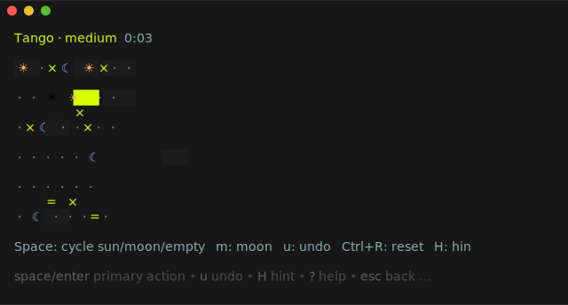

# TUI Minigames

[](https://github.com/Jensen95/tui-games/actions/workflows/ci.yml)
[](https://github.com/Jensen95/tui-games/actions/workflows/nightly.yml)
[](https://github.com/Jensen95/tui-games/releases)

Five LinkedIn-style logic puzzles in your terminal — **Tango, Queens, Zip,
Patches, and Mini Sudoku** — one Go binary, keyboard + mouse, built on
[Bubble Tea v2](https://charm.land). Every puzzle is generated on the fly,
offline and deterministically (seed in → puzzle out), and machine-verified to
be valid, **uniquely solvable**, and never a repeat.

<p align="center">
  
</p>

🎮 **[Play in your browser](https://jensen95.github.io/tui-games/)** — the same
Go engine, compiled to WebAssembly, as an installable PWA.

## The games

| Game | Grid | Goal |
|---|---|---|
| **Tango** | 6×6 | Balance suns and moons — no three in a row, honor `=`/`×` edges |
| **Queens** | N×N | One queen per row, column, and color region; queens never touch |
| **Zip** | 6×6+ | Draw one path through every cell, hitting the numbers in order |
| **Patches** | 5×5+ | Tile the grid with rectangles matching each clue's area and shape |
| **Mini Sudoku** | 6×6 | Classic Sudoku with digits 1–6 and 2×3 boxes |

Each game ships at ≥4 difficulties. Easy/Medium/Hard are guaranteed solvable
by pure logic (no guessing); Expert only guarantees a unique solution.

## Install

```sh
# stable
go install github.com/Jensen95/tui-games/cmd/lig@latest
# ...or grab a binary: linux / macOS / windows, amd64 + arm64
```

- **Stable:** [latest release](https://github.com/Jensen95/tui-games/releases/latest)
- **Edge:** [rolling prerelease](https://github.com/Jensen95/tui-games/releases/tag/edge),
  rebuilt on every push to `master`

## Play

```sh
lig
```

Two-handed scheme — left hand moves, right hand acts:

| Key | Action |
|---|---|
| `wasd` / arrows / `hjkl` | Move cursor |
| `Space` | Primary action (sun / X / pen / anchor) |
| `Shift+Space` | Secondary action (moon / queen / erase / remove)* |
| `1`–`6`, `Shift+1`–`6` | Sudoku: place digit / toggle pencil note* |
| `u` · `Ctrl+r` · `H` | Undo · reset · hint (names the technique) |
| `n` · `?` · `Esc` · `q` | New puzzle · help · menu · quit |

\* Modifier keys need a terminal with the Kitty keyboard protocol (kitty,
WezTerm, Ghostty, foot, recent Windows Terminal/iTerm2). Everywhere else the
plain-key fallbacks shown in the in-game help do the same job. The mouse works
everywhere: click, drag to draw Zip paths / stretch Patches rectangles / paint
Queens marks, right-click to clear.

## Headless CLI

The same engine drives a TUI-free path, used by CI fuzzing and corpus builds:

```sh
lig games                                                   # list engines
lig generate --game zip --difficulty hard --count 5 --seed 42 --out puzzles/
lig verify puzzles/*.json                                   # re-check: valid + unique
lig generate --game tango --count 100 --corpus corpus/      # cross-run dedup
```

## Development

Dev workflows run on [Task](https://taskfile.dev)
(`go install github.com/go-task/task/v3/cmd/task@latest`):

```sh
task              # lint + test + build
task run          # build and launch the TUI
task test:ci      # exactly what CI runs (race + full-seed suites)
task --list       # everything else (cover, fuzz, bench, corpus, nightly...)
```

### Architecture

`internal/engine` holds the frozen game-agnostic contracts (Validator, Solver,
Generator, Fingerprinter, registry) and is **pure Go** — no TUI, no I/O, no
`os`, enforced by `scripts/depguard.sh` in CI. Each game implements those
contracts in `internal/games/<name>`; the Bubble Tea TUI (`internal/tui`), the
headless CLI, and the WebAssembly build of the web app are all thin consumers
of the same engine. That seam is also what keeps a future Android port a
UI project instead of a rewrite.

Correctness is enforced by construction: every game has **two independently
authored solvers** that must agree, validator truth tables covering each
rule's near-misses, property tests over hundreds of seeds asserting the
generation invariant (valid + exactly one solution + logic-solvable +
deduplicated via symmetry-normalized fingerprints), and golden end-to-end TUI
tests. Seed count scales via `LIG_SEEDS` (CI 250, nightly 5000).

The full build plan this repo was grown from lives in
[`docs/plan/`](docs/plan/README.md).

## CI & releases

- **CI** — gofmt, vet, dependency guard, race + full-seed tests, build and a
  headless generate/verify smoke test, on every push and PR.
- **Nightly** — 5000-seed property runs, native fuzzing, corpus artifact.
- **Edge** — every push to `master` republishes the
  [`edge` prerelease](https://github.com/Jensen95/tui-games/releases/tag/edge)
  via a GoReleaser snapshot.
- **Releases** — push a `v*.*.*` tag (or dispatch the Release workflow with a
  version + publish) and GoReleaser ships binaries + checksums.
- **Web** — the PWA deploys to GitHub Pages from `web/` on every push to
  `master`.
